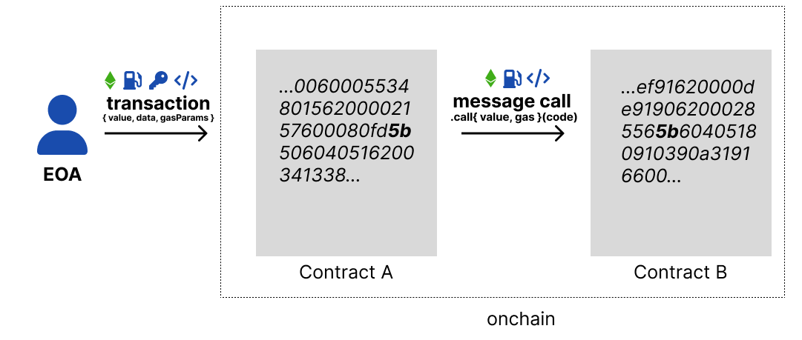

# Message Calls

- Send value and `calldata` to contracts
- The first message call is the beginning of the transaction (EOA -> contract)
- Each subsequent message call is part of the same transaction (contract -> contract)
- The transaction and any state changes only complete when the initial function call finishes execution

---



---

## Message Call Breakdown

- As we saw message calls can contain `gas`, `value` and `calldata`
- These message values become available as globals in solidity:

  - `msg.sender` - who made the last message call
  - `msg.value` - amount in wei sent
  - `msg.data` - calldata
  - `msg.sig` - the function identifier

---

## How Do EOAs and Contracts Call Other Contracts?

- They use the `address` of the contract they want to communicate with
- This is a data type in solidity that is 20 bytes long
- The `msg.sender` from the previous slide is an address

---

## What does that look like?

```js
contract X {
  address deployer;
  address otherContract;

  constructor(address _otherContract) {
    deployer = msg.sender;
    otherContract = _otherContract;
  }
}
```

---

## Can any method call receive ether?

Only `payable` methods can:

```js
contract X {
// if there is no `payable` keyword and if you try to send value; the transaction will fail(revert). 
//Special method Only runs when you send value and calldata doesnt match any existing function signatures(typically EOA --> EOA)
  receive() external payable {
    // no calldata necessary here
    // just send a value on the message call
  }

  function pay() external payable {
    // in this case, we target pay with a value. regardless of any code; the balance of this contract will increase by msg.value amount.
  }
}
```

---

## What does sending value look like?

The `.call` syntax is `.call{ gas, value }(calldata)`

```js
contract X {
  address otherContract;

  constructor(address _otherContract) payable {
    otherContract = _otherContract;
    _otherContract.call{ value: msg.value }("");
  }
}
```

---

## Handle the success

The solidity compiler will warn you if you don't handle `success`

```js
contract X {
  address otherContract;

  constructor(address _otherContract) payable {
    otherContract = _otherContract;
    (bool success, ) = _otherContract.call{ value: msg.value }("");
    require(success);
  }
}
```
